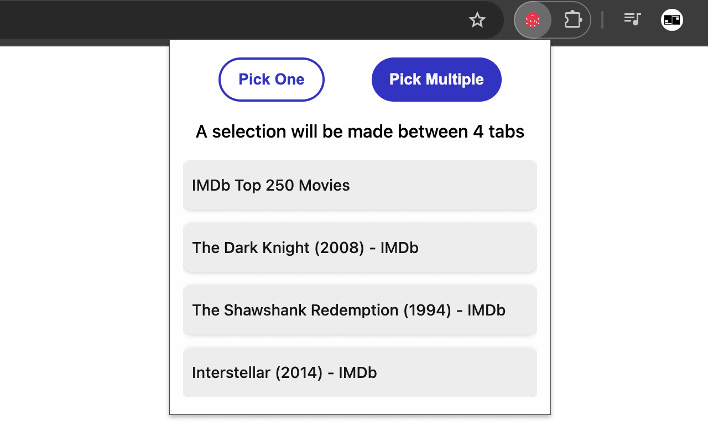
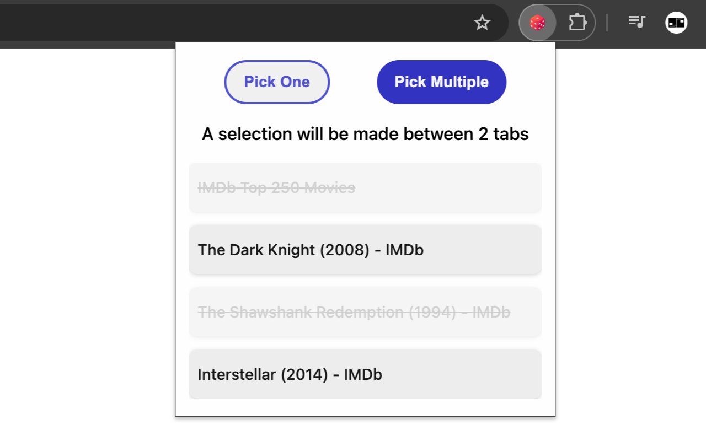

# Random Tab Picker - Chrome Extension

## About the project

Random Tab Picker is a Chrome extension that helps you decide on things, such as what movie to watch. Simply open all the movies (or anything you are indecisive about) on different tabs and let the extension pick a random tab or more for you.

## Installation

You can simply install the extension to the Chrome app from the Chrome Web Store using [this](https://chromewebstore.google.com/detail/random-tab-picker/kdoafmhlaphhaemmojbjdmeeibgjkihd) link.

### If you prefer to locally install the extension instead

<ol>
  <li>Download the repository and extract the ZIP</li>
  <li>Open the Chrome app > Extensions > Manage Extensions</li>
  <li>Turn on the developer mode located on the top right</li>
  <li>Click on the "Load unpacked" button on the top left and select the repository folder.</li>
</ol>

## Example use case

Let's say you want to watch a movie but you can't decide what to watch between 3 movies. You open each movie on a new tab and start using the Random Tab Picker. You also have another random tab open that isn't related to the random selection.

In this case, this is what the extension would look like:

Since you don't want the first tab on the list to be a part of the random selection, you click on it which removes it from the selection.\*

You remember that you have already seen the Shawshank Redemption before and you don't want to watch it again. So you click on it in the extension to remove it from the list as well.

At this point, this is what the extension would look like:

Now all you have to do is click on the "Pick One" button, and the extension will select a random movie for you. Once the selection is made, the extension will automatically redict you to the selected tab.

\*This only affects the list within the extension, not your browser. The tab you removed in the extension remains open on your browser. If you want to add back a tab that you initially removed, you simple click on it again which will add it back to the selection list.

\*\*If the active tab hasn't changed after you clicked on the button, it's because the randomly selected tab was already the active one.

### How to select multiple random tabs

If you want to pick multiple tabs, you can follow the same steps and click the "Pick Multiple" button instead of "Pick One". Then you will be asked how many random tabs you want the extension to pick. The extension will then create a tab group called "SELECTED" with the random tabs it selected and redirect you to one of those tabs.

## Contact me

If you have any questions or simply want to get in touch, shoot an email to denesakin@gmail.com
